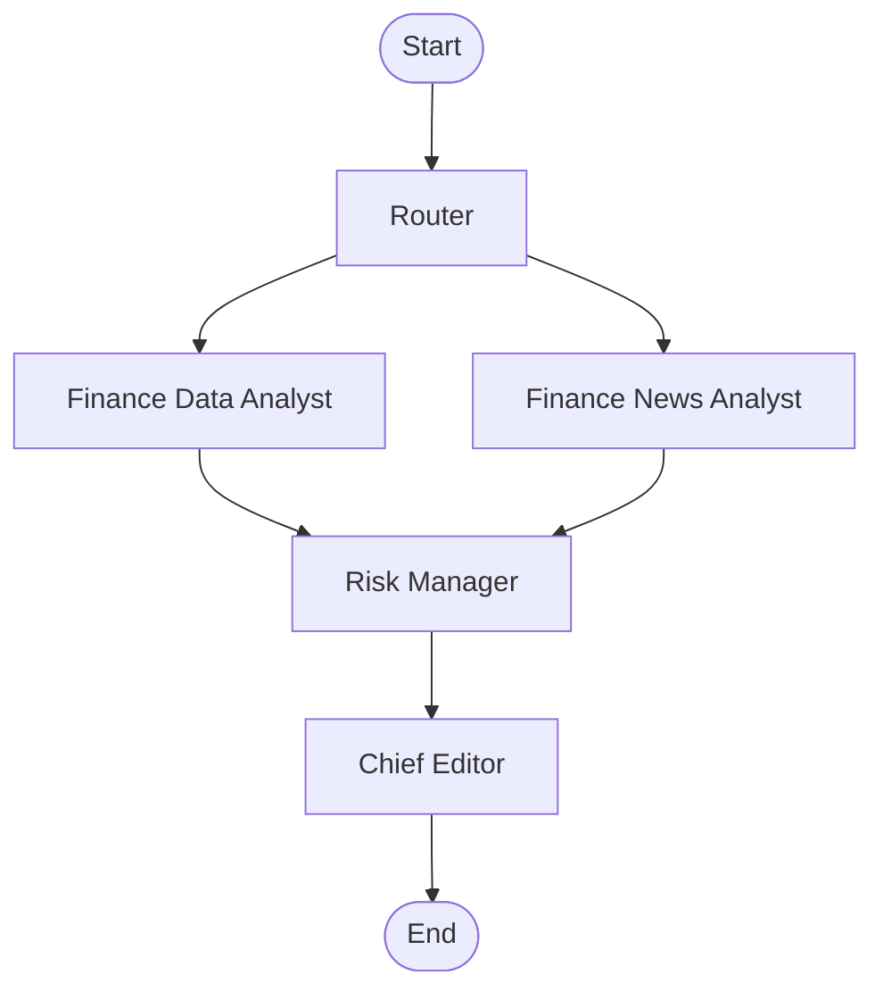

# Multi-Agent Investment Research Assistant

A powerful, agentic AI system designed to perform comprehensive investment research. Built with **LangChain v1.0+** and **LangGraph v1.0+**, it orchestrates a team of specialized AI agents to analyze financial data, news sentiment, and risks, culminating in a professional investment memo.


## 🚀 Features

-   **Multi-Agent Architecture**: Uses a supervisor-worker pattern with specialized roles (Router, Data Analyst, News Analyst, Risk Manager, Chief Editor).
-   **Real-time Data**: Fetches live market data using `yfinance`.
-   **News Analysis**: Searches and summarizes recent news using `duckduckgo-search`.
-   **Risk Assessment**: dedicated agent for identifying downside risks and volatility.
-   **Modern Tech Stack**: Built on the latest LangChain and LangGraph APIs (v1.0+), using `uv` for fast package management.

## Screenshots


*Natural Language Input Interface*


*Real-time Market Dashboard*


*AI-Generated Investment Report*

## 📊 Workflow



## 🤖 Agent Roles

1.  **Router**: Analyzes your query to identify stock tickers.
2.  **Finance Data Analyst**: Fetches price history, valuation metrics (P/E, Market Cap), and technical trends.
3.  **Finance News Analyst**: Scours the web for recent news, earnings reports, and market sentiment.
4.  **Risk Manager**: Synthesizes data and news to flag potential risks (volatility, regulatory, etc.).
5.  **Chief Editor**: Compiles all insights into a structured, markdown-formatted Investment Memo.

## 🛠️ Prerequisites

-   **Python 3.11+**
-   **[uv](https://github.com/astral-sh/uv)** (Fast Python package installer and resolver)
-   **OpenAI API Key** (for GPT-4o)

## 📦 Installation

1.  **Clone the repository**:
    ```bash
    git clone <repository-url>
    cd agent_investment_sup
    ```

2.  **Install dependencies using `uv`**:
    ```bash
    uv sync
    ```

    This creates a virtual environment in `.venv`. You can activate it manually if needed:

    - **Mac/Linux**: `source .venv/bin/activate`
    - **Windows**: `.venv\Scripts\activate`

3.  **Configure Environment**:
    Create a `.env` file in the root directory:
    ```bash
    # OpenAI (Default)
    OPENAI_API_KEY=sk-...
    LLM_PROVIDER=openai
    LLM_MODEL=gpt-4o

    # Google Gemini (Optional)
    # GOOGLE_API_KEY=AI...
    # LLM_PROVIDER=google
    # LLM_MODEL=gemini-1.5-pro
    ```

## 🏃‍♂️ Usage

### 1. Command Line Interface (CLI)

Run the assistant with a natural language query:

```bash
uv run python -m src.main "Analyze NVDA and AMD"
```

Or for a single ticker:

```bash
uv run python -m src.main "Analyze TSLA"
```

### 2. Web UI (Streamlit)

For an interactive experience, launch the Streamlit web interface:

```bash
uv run streamlit run ui.py
```

This will open the UI in your browser (typically at `http://localhost:8501`).

### 3. REST API (FastAPI)

To run the backend API server:

```bash
uv run uvicorn src.api:app --reload
```

The API will be available at `http://localhost:8000`. You can access the interactive API docs at `http://localhost:8000/docs`.

## 📂 Project Structure

```
├── src/
│   ├── agents/          # Agent definitions (Router, Analysts, Editor)
│   ├── tools/           # Tool wrappers (yfinance, search)
│   ├── api.py           # FastAPI backend
│   ├── graph.py         # LangGraph orchestration logic
│   ├── main.py          # CLI Entry point
│   └── state.py         # Shared agent state definition
├── ui.py                # Streamlit Web UI
├── pyproject.toml       # Project dependencies (managed by uv)
├── uv.lock              # Dependency lock file
└── README.md            # This file
```

## 🔧 Tech Stack

-   **LangGraph**: State-based orchestration for cyclic multi-agent workflows.
-   **LangChain**: Core framework for LLM interactions and tools.
-   **yfinance**: Market data provider.
-   **DuckDuckGo Search**: Web search provider.
-   **Pydantic**: Data validation and settings management.

## 📄 License

MIT
